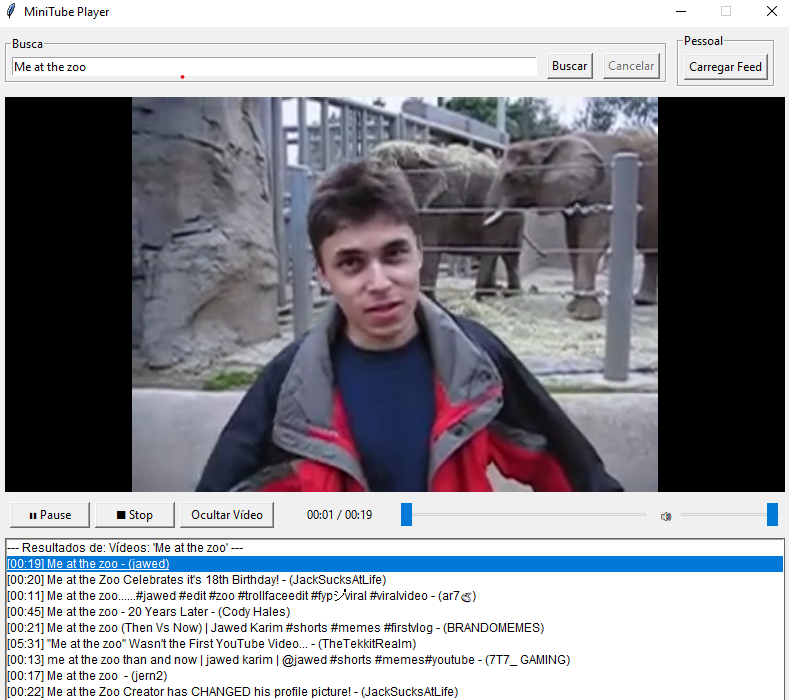

# MiniTube Player

Um player de YouTube simples feito em Python e Tkinter, focado em baixo consumo de recursos e uma experiência de uso limpa.



---

## Funcionalidades

* **Busca de Vídeos:** Pesquise por vídeos diretamente na interface.
* **Player de Vídeo Integrado:** Assista aos vídeos na própria janela do aplicativo, sem pop-ups, utilizando o VLC.
* **Controles de Reprodução Completos:**
    * Play / Pause
    * Barra de Progresso.
    * Controle de Volume.
    * Mostrador de Tempo.
* **Modo Apenas Áudio:** Oculte o vídeo a qualquer momento com o botão "Ocultar Vídeo" para ouvir apenas o áudio, economizando recursos.
* **Feed do Youtube:** Carregue os vídeos mais recentes dos seus cookies.
    * Possui um sistema com *fallback*: tenta usar os cookies do navegador e, se falhar, usa um arquivo local `youtube-cookies.txt`.
* **Leve e Rápido:** Projetado para consumir o mínimo de RAM e processamento possível.

---

## Pré-requisitos

Antes de instalar, garanta que você tenha os seguintes programas no seu sistema:

1.  **Python 3.8+**: [python.org](https://www.python.org/)
2.  **VLC Media Player (aplicativo completo):** A biblioteca `python-vlc` precisa da instalação principal do VLC para funcionar.
    * Baixe em: [videolan.org](https://www.videolan.org/vlc/)
    * **Importante:** Instale a versão do VLC com a mesma arquitetura do seu Python (geralmente 64-bit para ambos).

---

## Instalação

Siga estes passos para rodar o projeto em seu computador:

1.  **Clone o repositório:**
    ```bash
    git clone [https://github.com/seu-usuario/seu-repositorio.git](https://github.com/seu-usuario/seu-repositorio.git)
    cd seu-repositorio
    ```

2.  **(Recomendado) Crie e ative um ambiente virtual:**
    ```bash
    # No Windows
    python -m venv venv
    .\venv\Scripts\activate
    
    # No macOS/Linux
    python3 -m venv venv
    source venv/bin/activate
    ```

3.  **Instale as dependências:**
    Use o arquivo `requirements.txt` para instalar as bibliotecas necessárias.
    ```bash
    pip install -r requirements.txt
    ```

---

## Como Usar

1.  **Para executar o aplicativo:**
    ```bash
    python minitube_final.py
    ```

2.  **Busca de Vídeos:**
    * Digite o termo desejado na barra de busca e clique em "Buscar".
    * Duplo-clique em um item da lista para iniciar a reprodução.

3.  **Carregar o Feed de Inscrições:**
    * O botão "Carregar Feed" tentará usar os cookies do seu navegador (configurado para o Chrome por padrão). Para que isso funcione, o navegador deve estar **totalmente fechado**.
    * Se a busca no navegador falhar, o aplicativo procurará por um arquivo `youtube-cookies.txt` na mesma pasta. Para criar este arquivo:
        1.  Instale a extensão "Get cookies.txt" no seu navegador.
        2.  Acesse `youtube.com`.
        3.  Clique na extensão e exporte os cookies.
        4.  Salve o arquivo baixado com o nome `youtube-cookies.txt` na pasta do projeto.

---

## Licença

Este projeto é distribuído sob a licença MIT. Veja o arquivo `LICENSE` para mais detalhes.
